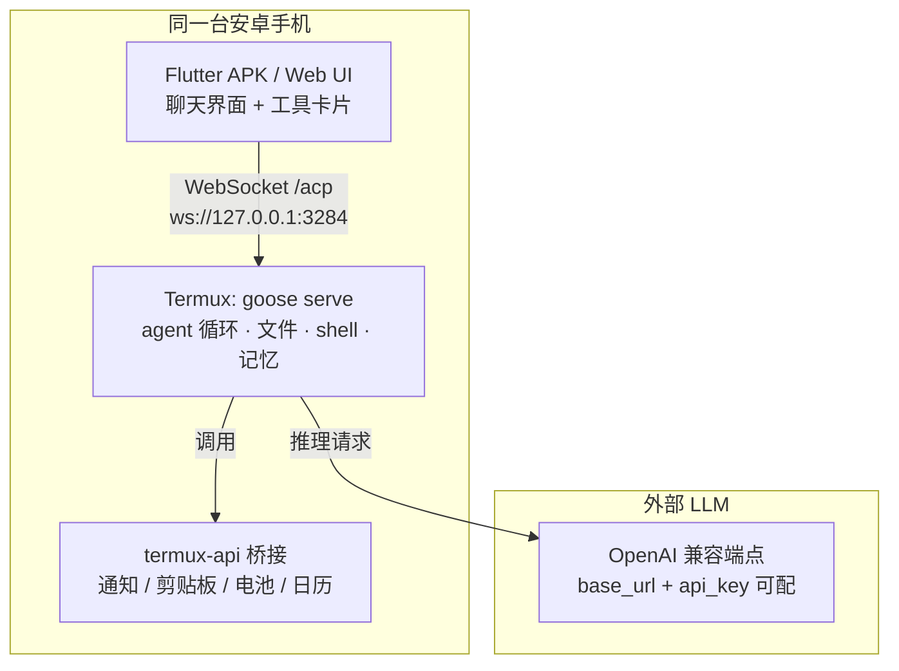

<div align="center">
  <h1>termux-agent · Android Agent</h1>
  <p>在安卓手机上运行的通用 AI Agent · 基于 [goose](https://github.com/aaif-goose/goose)（Apache-2.0, Rust）· 全部运行在本地，LLM 走外部 API</p>
  
  
  
  
  <br />
  <p>
    <a href="https://github.com/X33834/termux-agent">GitHub</a> ·
    <a href="https://gitcode.com/badhope/termux-agent">GitCode</a> ·
    <a href="https://gitee.com/badhope/termux-agent">Gitee</a>
  </p>
</div>

---

## 架构图



---

## 快速开始

### 方案 A：网页版（推荐，免装 APK）

```bash
# 1. 手机侧一次性安装 goose 二进制
pkg install termux-api && termux-setup-storage
bash termux/install.sh all   # 拉取预编译 goose + 配置 provider

# 2. 一键启动（自动装依赖、构建前端、拉起 goose + node）
bash web/start.sh            # 默认端口 5173
# 浏览器打开 http://<机器IP>:5173 → 页面「⚙ 设置」配 LLM API key → 开聊
```

### 方案 B：Flutter APK

```bash
cd app && bash scripts/build_apk.sh
# 产物: app/build/app/outputs/flutter-apk/app-debug.apk（需 8GB+ 内存机器）
```

---

## 目录

| 路径 | 说明 |
|------|------|
| `config/provider.json` | OpenAI 协议端点配置（已预填 Agnes AI） |
| `termux/install.sh` | 一键安装脚本（goose + provider + API key） |
| `termux/termux-bridge` | Android 原生能力桥接（通知/剪贴板/电池等） |
| `web/` | Vite + React + TS 网页版前端（`server.mjs` 自管 goose 子进程） |
| `app/` | Flutter 安卓聊天 UI（WebSocket 连接 ACP 协议） |

> 上游 goose 源码（约 3GB）已 gitignore 排除，不在本仓库。`termux/install.sh all` 可拉取预编译版。

---

## 日常使用

```bash
# 交互式会话
source ~/.agent/termux.env
~/.local/bin/goose session

# 带记忆
~/.local/bin/goose session --with-builtin memory

# 非交互（管道输入）
echo "list my files" | ~/.local/bin/goose run

# 调 Android 原生能力
termux-bridge notify "提醒" "喝水"
termux-bridge clipboard-get
```

---

## 数据边界

- **本地**：agent 代码、会话、文件读写、shell 执行、termux-api 调用
- **云端（仅推理）**：LLM API。agent 上下文可能携带本地文件内容，敏感文件需自行做白名单/脱敏

---

## License

Apache-2.0（goose 上游）· 本仓库裁剪部分见 [LICENSE](LICENSE)
